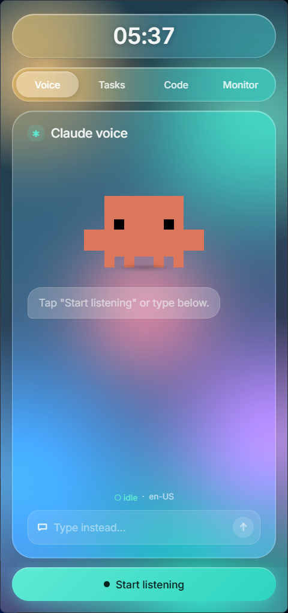
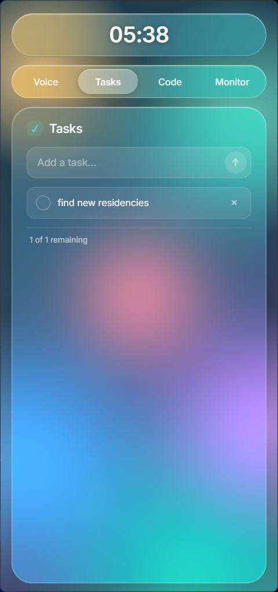
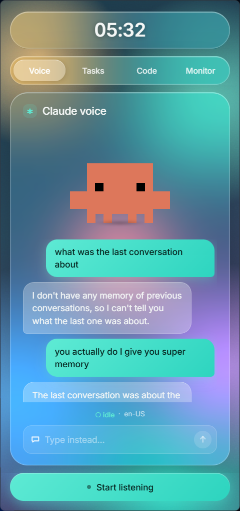
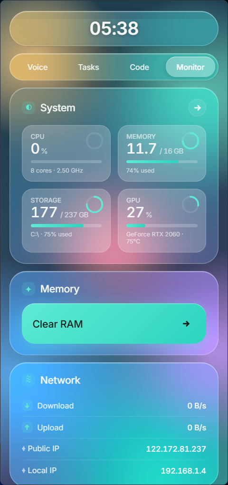
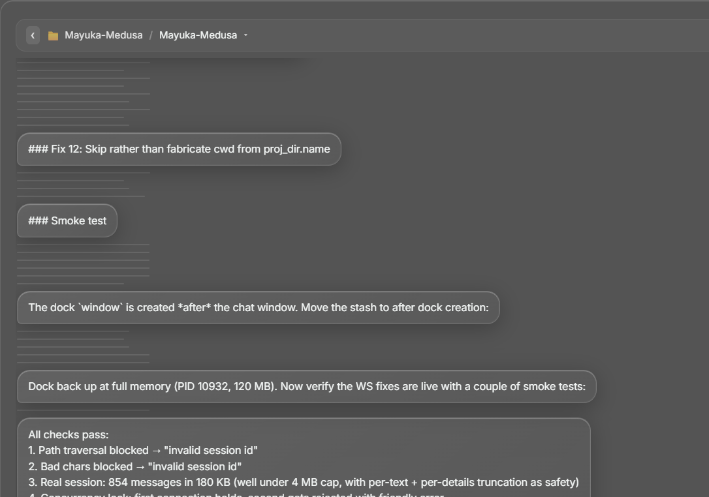
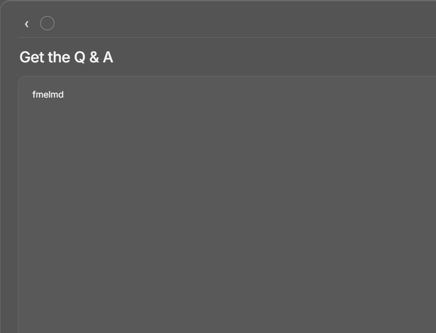

# clawd-dock

A frameless, always-visible side dock for Windows that puts Claude on the right edge of your screen — with voice chat, todos, a Claude Code session navigator, live system monitor, and an MCP server so Claude can read and act on your machine.

The dock registers as a Win32 AppBar so other windows reflow around it (just like the Windows taskbar) — it never overlaps your work, and it's always one glance away.

## Prerequisites

- **Windows 10 / 11**
- **Python 3.10+** ([python.org](https://www.python.org/downloads/) — make sure "Add to PATH" is checked during install)
- **Microsoft Edge WebView2 Runtime** — pre-installed on Windows 11. On Windows 10 grab the [evergreen installer](https://developer.microsoft.com/en-us/microsoft-edge/webview2/).
- **Node.js + Claude Code CLI** for the Voice and Code tabs:
  ```powershell
  npm install -g @anthropic-ai/claude-code
  ```
- **NVIDIA GPU** *(optional)* — required for the GPU widget on the Monitor tab. AMD/Intel-only machines just see "no NVIDIA GPU" and everything else works.

## Install

```powershell
git clone git@github.com:juggernaut695/clawd-dock.git
cd clawd-dock
pip install -e .
```

That installs the `pc-manager-mcp` package and registers the `pc-manager-tray` and `pc-manager-mcp` entry points.

## Run

### Side dock (the main UI)

```powershell
pythonw -m pc_manager.dock
```

…or double-click `start.bat` for a no-console launch.

Set `PC_MANAGER_DEBUG=1` to enable WebView2 DevTools (F12 inside the dock).

### Tray icon (lightweight — just live stats, no UI)

```powershell
pc-manager-tray
```

### Auto-start on login

Press `Win+R`, type `shell:startup`, and drop a shortcut to `start.bat` into that folder.

### Connect Claude Code to the MCP server

```powershell
claude mcp add pc-manager pc-manager-mcp
```

Then in any Claude Code session:

> *how's my PC right now?*
> *what's eating my RAM? clear it.*
> *kill the chrome process with PID 12345*

## Screenshots

### The dock — four tabs on the right edge of the screen

|  Voice  |  Tasks  |  Code  |  Monitor  |
| :-----: | :-----: | :----: | :-------: |
|  |  |  |  |

### Standalone windows

Click a Recent in the **Code** tab and you get a frosted-glass chat window that replays the full conversation (text + collapsible "Edited a file, ran 2 commands ›" pills) and resumes the session via `claude -p --resume`:



Click any task in the **Tasks** tab and a separate task editor pops out for the title + notes:



## What's in it

### Voice tab
- Push-to-talk Claude assistant with a pixel-art mascot ("Clawd") that animates per state (idle / listening / thinking / speaking).
- STT via `SpeechRecognition` (Google free tier by default), TTS via Microsoft Edge neural voices (Aria) with a `pyttsx3` (SAPI) fallback.
- Persistent session — uses the [Claude Agent SDK](https://github.com/anthropics/claude-agent-sdk) so the warm process survives between turns (sub-second response after the first).
- "Type instead..." composer for typed prompts when voice isn't practical.

### Tasks tab
- Local checklist that persists across launches.
- Add / complete / clear-completed straight from the dock or from Claude (`add_task`, `set_task_done`, `list_tasks`).

### Code tab
- Lists every recent Claude Code session on the machine (parsed live from `~/.claude/projects/<dir>/<uuid>.jsonl`).
- Click a session to open a dedicated frosted-glass chat window that:
  - replays the full conversation history (text + collapsible "Edited a file, ran 2 commands ›" pills for tool uses),
  - resumes the session via `claude -p --resume <id>`,
  - streams responses live with a "Stewing…" indicator and final duration / token meta.
- Multi-instance "Cowork" mode — broadcast the same prompt to several running Claude Code instances at once.

### Monitor tab
- Live CPU / RAM / Storage / GPU panel (NVIDIA via NVML; AMD/Intel-only machines see "no NVIDIA GPU" and everything else still works).
- Top processes with kill button.
- "Clear RAM" — calls Windows `EmptyWorkingSet` across accessible processes to free standby memory.
- Public + local IP, live up/down throughput.

### Tray icon
- System-tray bar that mirrors the dock's CPU / RAM / GPU readouts even when the dock is hidden.

### MCP server (`pc-manager-mcp`)

Nineteen tools exposed to Claude Code so you can let it drive the box:

- **Stats**: `get_system_stats`, `get_cpu_stats`, `get_ram_stats`, `get_gpu_stats`, `get_disk_stats`, `get_top_processes`
- **Process control**: `kill_process`, `clear_ram`
- **Tasks**: `add_task`, `list_tasks`, `set_task_done`, `delete_task`, `clear_completed_tasks`
- **Persistent memory**: `remember`, `read_memory`, `update_memory`, `clear_memory`
- **Claude instance groups**: `create_claude_group`, `list_claude_groups`, `add_claude_instance`, `remove_claude_instance`, `delete_claude_group`, `launch_claude_instance`

## Stack

- **pywebview 5+** + **Edge WebView2** for the dock surface (acrylic / blur backdrop, transparent chat windows).
- **React 18 + Babel** loaded via CDN — no build step. JSX lives in `pc_manager/web/`.
- **WebSocket bridge** on `127.0.0.1:7654`:
  - `/term/<id>` — xterm.js ↔ ConPTY (via `pywinpty`)
  - `/chat/<id>` — streams `claude -p --output-format stream-json` deltas + tool-use summaries
  - `/history/<id>` — one-shot replay of a Claude Code session JSONL
- **Claude Agent SDK** for the persistent voice loop.
- **MCP** (Model Context Protocol) server (`pc_manager/server.py`) for the 19 tools above.
- **Win32 AppBar** registration so the dock pins to the right edge and reflows everything else around it.

## Engineering notes

A few of the safety / robustness measures that went into the current build:

- Path-traversal guard on the `/history/<sid>` and `/chat/<sid>` WS endpoints (UUID-shape regex + `Path.resolve().is_relative_to(base)` defense in depth).
- 5-minute readline timeout around `claude -p` so a hung subprocess gets killed and surfaced rather than spinning forever.
- Per-`chat_id` lock so a second tab can't double-spawn `claude -p --resume` and corrupt the shared JSONL.
- Subprocess cleanup on WS disconnect — orphan `claude` processes are `kill()`ed in `finally`.
- 4 MB WS-frame budget enforced (per-message text truncation + halve-the-list fallback) so long sessions don't blow past `max_size`.
- Dock-shutdown teardown of the chat window so it doesn't end up orphaned.
- Default `--permission-mode=acceptEdits` is **off** in the chat window — you opt in per session.

## Limitations

- **Windows only.** AppBar + ConPTY + pywin32 paths are all Windows-specific.
- **Claude Desktop sessions only partially resumable.** `claude -p --resume <id>` works for sessions written by the CLI; Desktop-app sessions sometimes can't be resumed by the CLI version on `PATH` if the versions don't match. The dock surfaces stderr if this happens.
- **`get_claude_chats` is synchronous** — scanning many large JSONLs (40 MB+) on the dock thread can briefly stall the JSON-RPC bridge. A background mtime cache is on the roadmap.
- **`nvidia-ml-py` is currently a hard dependency** — soft-import / platform-marker is on the roadmap so AMD-only boxes don't carry the wheel.

## Project layout

```
pc_manager/
├── dock.py              # pywebview launcher, AppBar reg, JS-Python API, WS server
├── server.py            # MCP server (19 tools)
├── monitor.py           # CPU / RAM / GPU / disk / network sampling
├── ram_clear.py         # EmptyWorkingSet driver with safety filter
├── voice.py             # Voice loop (STT + Claude Agent SDK + TTS)
├── terminal.py          # ConPTY wrapper + terminal registry
├── tray.py              # System-tray icon (live bars)
├── dashboard.py         # Standalone dashboard window
└── web/
    ├── index.html       # Shell + dock CSS + chat-window CSS
    ├── app.jsx          # Main React app (dock + chat-window mode)
    ├── clawd.jsx        # Voice mascot animation
    └── side-dock.css    # Dock-surface styles (panels, header, glass)
```

## License

Not yet specified. Treat as "all rights reserved" until a license is added.

## Status

Alpha. Issues and PRs welcome.
